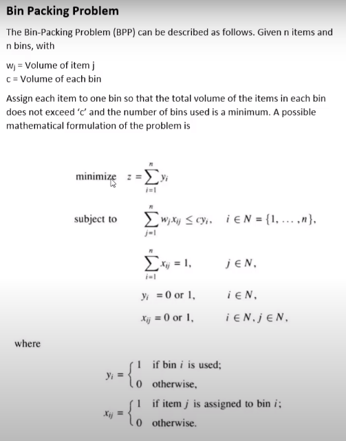

# BIN_PACKING CPLEX


BIN_PACKING-CPLEX é um(a) `script python` que permite a execução via `linha de comando` para `resolver uma instância` do problema de empacotamento.

O código escrito aqui foi graças ao vídeo [Rohit Kalla: Solve Bin Packing problem in CPLEX](https://www.youtube.com/watch?v=zvMYwx92wcw).

## Do que se trata o problema de empacotamento?

"No problema de bin packing (ou problema do empacotamento),
objetos de diferentes volumes devem ser embalados em um número
finito de bandejas ou recipientes de volume V de uma forma que
minimize o número de recipientes utilizados." Wikipédia, acessado em: 19/07/2020. Website:[https://pt.wikipedia.org/wiki/Problema_do_empacotamento](https://pt.wikipedia.org/wiki/Problema_do_empacotamento)


Fonte: [Rohit Kalla: Solve Bin Packing problem in CPLEX](https://www.youtube.com/watch?v=zvMYwx92wcw)

## Pré-requisitos

Antes de começar, verifique se você atendeu aos seguintes requisitos:

- Você instalou o [Docker](https://docs.docker.com/get-docker/)?

## Instalando

```shell
git clone https://github.com/HerlanAssis/bin_packing-cplex
```

## Utilizando

Para usar o utilitário, siga estes passos:

1. Utilize o ambiente docker já configurado:

```python
./build_and_run.sh
```

2. Dentro do container, execute:

```python
python knapsack.py instances/<folder>/<instance>
```

## TODO

- [x] ~~Escrever README~~
- [ ] Validar entrada no executável

## Contribuindo

Caso queira fazer alguma melhoria, siga estes passos:

1. Fork esse repositório.
2. Crie uma branch: `git checkout -b <branch_name>`.
3. Faça suas mudanças e comite para: `git commit -m '<commit_message>'`
4. Push para a branch de origem: `git push origin <nome_projeto>/<location>`
5. crie um pull request.

Como alternativa, consulte a documentação do GitHub em [criando uma pull request](https://help.github.com/pt/github/collaborating-with-issues-and-pull-requests/creating-a-pull-request).

## Contato

Se você quiser entrar em contato comigo, entre em contato com herlanassis@gmail.com.
